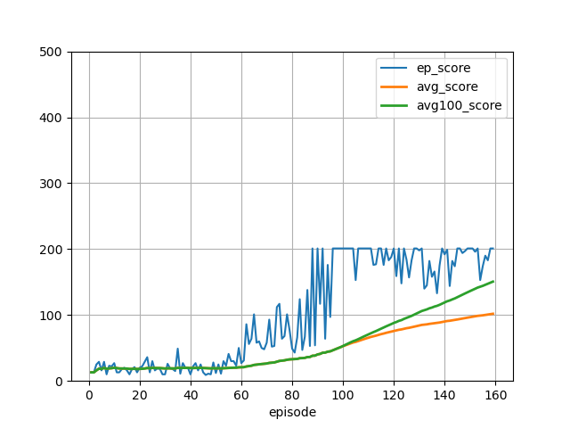
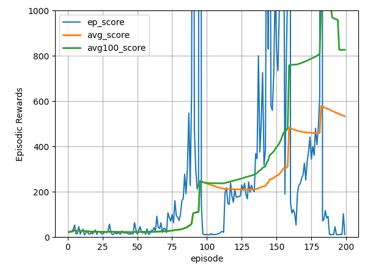
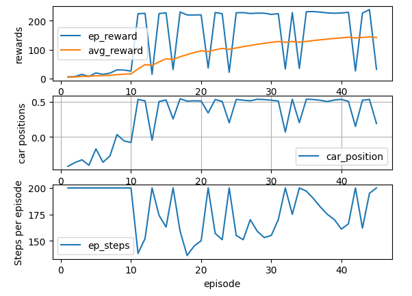
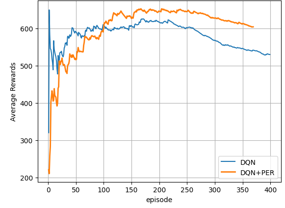

# Performance of DQN Algorithms

| Problem / Environment | Comments |
| --------------------- | -------- |
| CartPole-v0 | 
|  | In v0, max score is 200 |
| CartPole-v1 |
|  | In v1, problem is solved in about 200 episodes. |
| MountainCar-v1 |
|  | | 
| Pacman-v1 (Atari) |
|  | PER improves the performance of DQN. | 