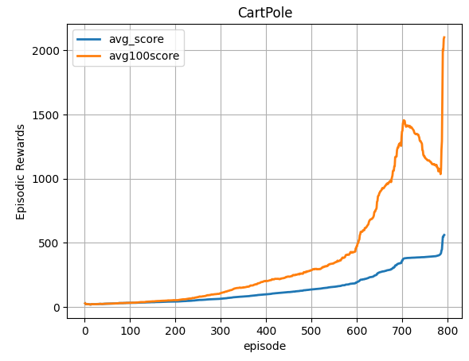
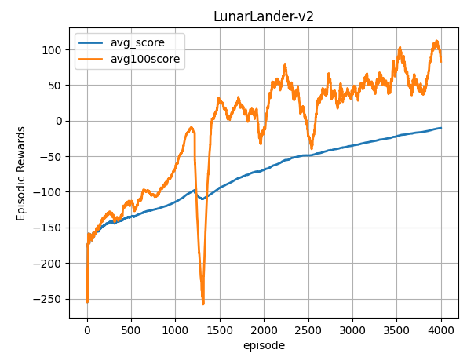
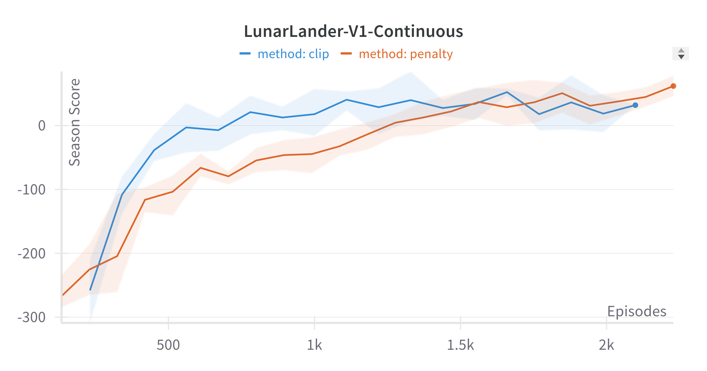
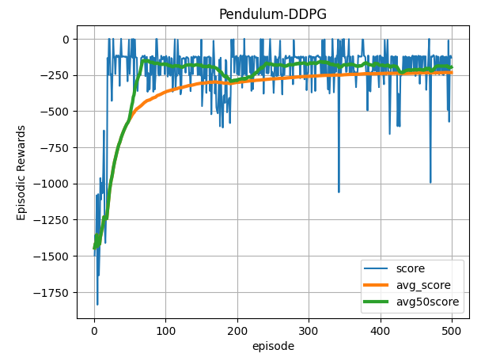
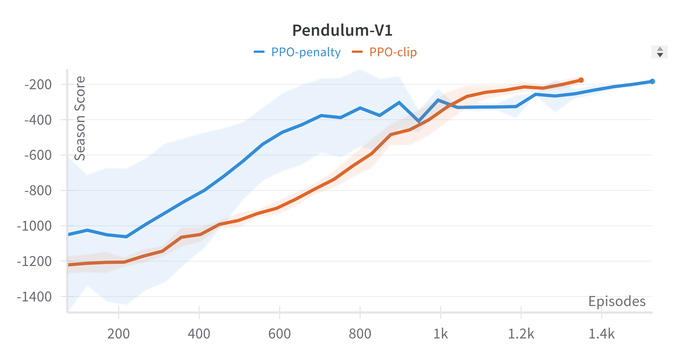

## Performance Policy Gradient Algorithms

| Problem Environment / Algorithm | Comments |
| ------------------------------- | -------- |
| Solving CartPole-v1 with Reinforce Algorithm| 
|  | Reinforce solves the problem in about 800 episodes. |
| LunarLander-v2|
|  | Reinforce solves the problem in about 5000 episodes. |
|  | PPO is comparatively faster compared to reinforce algorithm. |
| Pendulum-v1 |
|  | ddpg solves the problem in about 500 episodes. It is faster compared to PPO as it is an off-policy algorithm that uses a replay buffer to provide better sampling efficiency. | 
|  | PPO solves the problem in about 1400 episodes. PPO being an on-policy algorithm has slower convergence compared to DDPG. | 