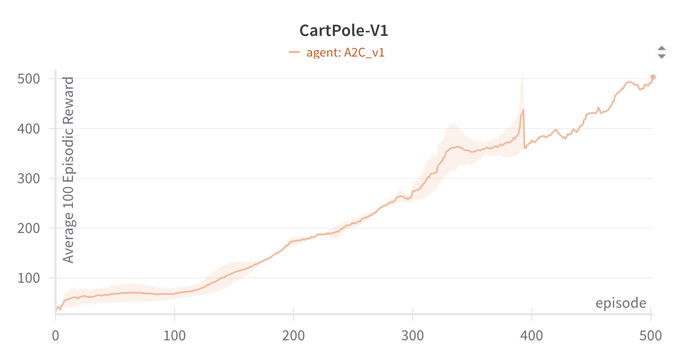
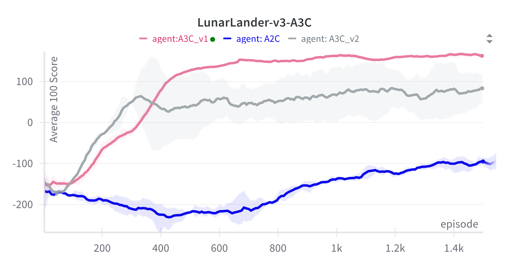

# Performance of Actor-Critic Algorithms

| Environment / Plot | Comments |
| ------------------ | -------- |
| CartPole-v1 |
|  | A2C solves the problem in about 500 episodes |
| LunarLander-v3 |
|  | A3C performs much better than A2C algorithm. However, the problem is not successfully solved even in 1400 episodes. | 