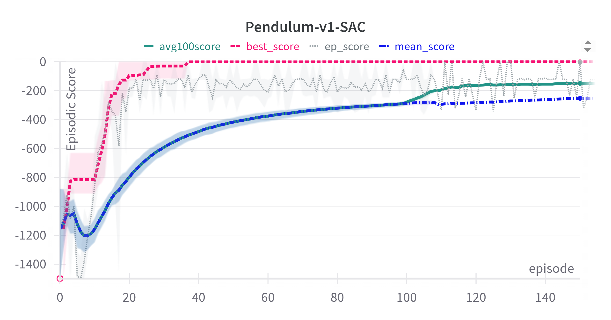
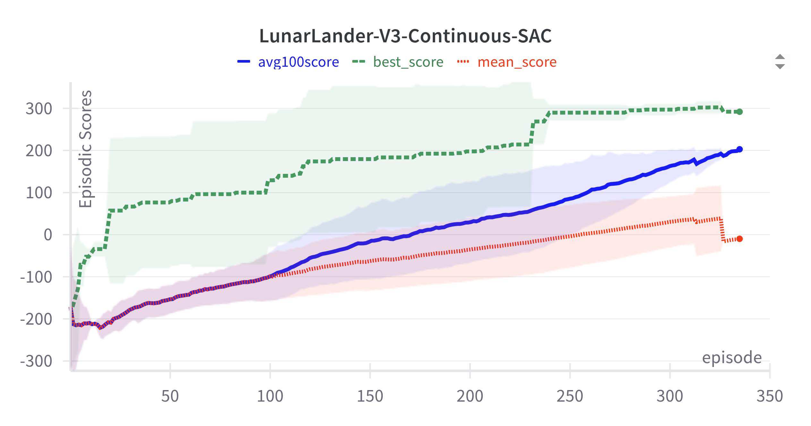
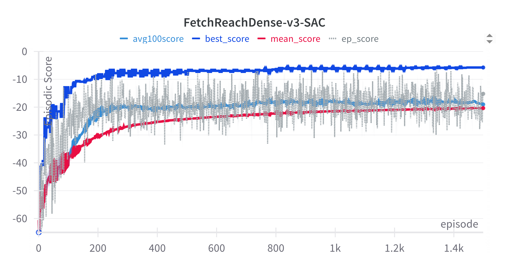
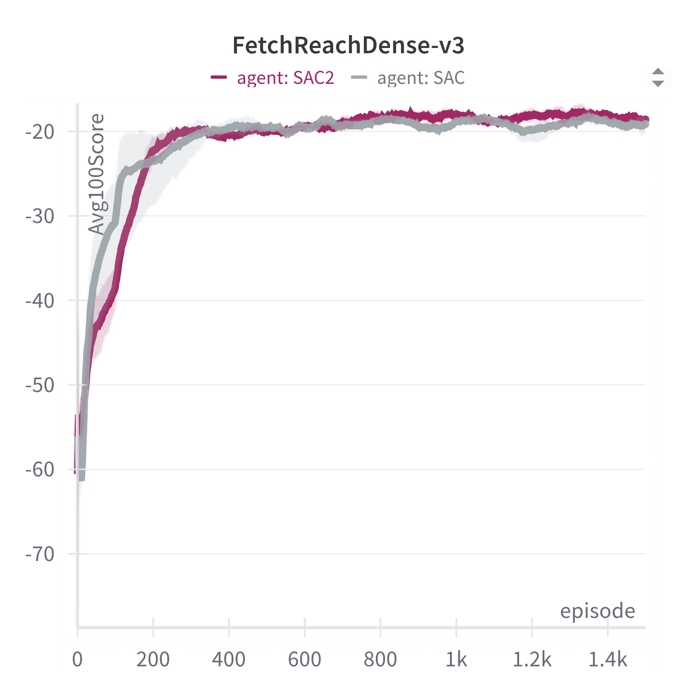
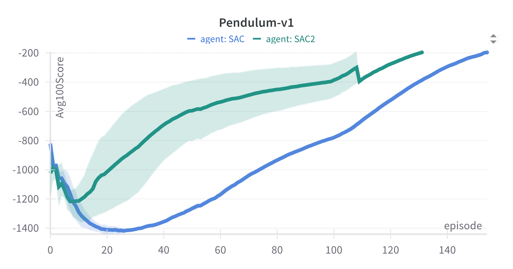
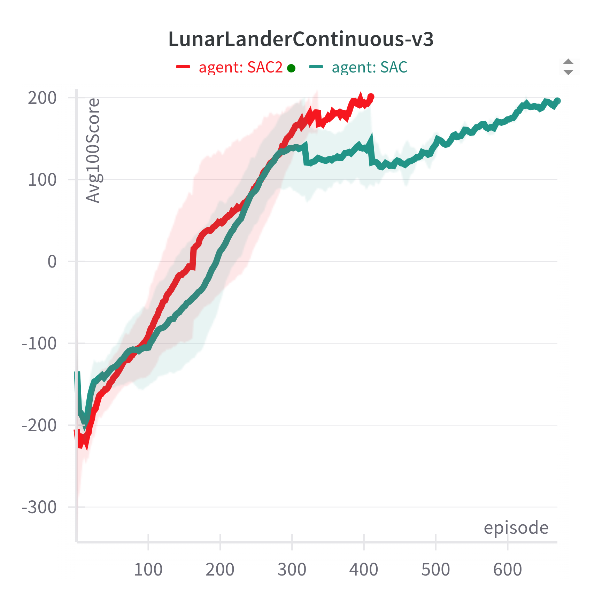

# Performance of SAC Algorithm
| Problem | Comments | 
| ----------- | ------------------------ | 
| Pendulum-v1 |                           
|  | The problem is solved in about 100 episodes. |
| LunarLanderContinuous-v3 |
|  | The problem is solved in about 300 episodes. |
| FetchReachDense-v3 |
|  | Ideally, the average reward of last 100 episodes should reach closer to 0 for success. The best episodic reward achieved is about -6. |

## SAC versus SAC2

* SAC2 uses a separate value network and a target value network in addition to using two critic networks.  
* SAC uses two critic network and two target critic networks.

| Environment / Plot | Comments |
| ------------------ | -------- |
| FetchReachDense-v3 | 
|  | Both SAC2 & SAC have similar performance |
| Pendulum-v1 | 
|  | SAC2 performs slightly better than SAC |
| LunarLanderContinuous-v3 |
|  | SAC2 performs better than SAC |
